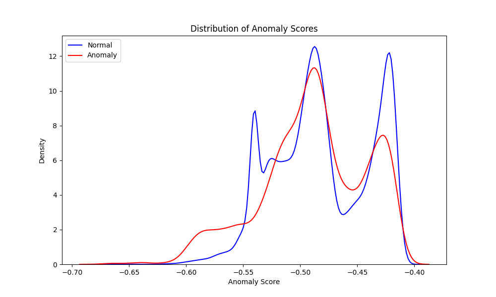
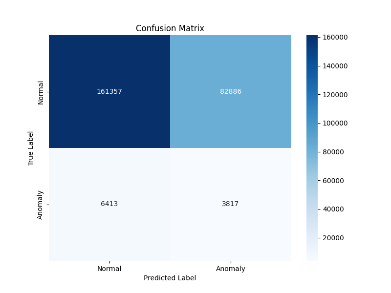

# Isolation Forest Model Validation Results

Generated at: 2025-05-11 12:22:01

## Best Model Metrics

### Performance Metrics
| Metric | Value |
|--------|-------|
| Accuracy | 0.8467 |
| Precision | 0.0458 |
| Recall | 0.1419 |
| F1 Score | 0.0693 |

### Confusion Matrix
```
True Negative: 214008, False Positive: 30235
False Negative: 8778, True Positive: 1452
```

## All Models Performance Summary

| Rank | F1 Score | Accuracy | Precision | Recall | Parameters |
|------|----------|----------|-----------|---------|------------|
| 1 | 0.0693 | 0.8467 | 0.0458 | 0.1419 | n_estimators=200, contamination=0.04, max_samples=auto, max_features=1.0 |

## Visualizations

### Anomaly Scores Distribution


### Confusion Matrix


